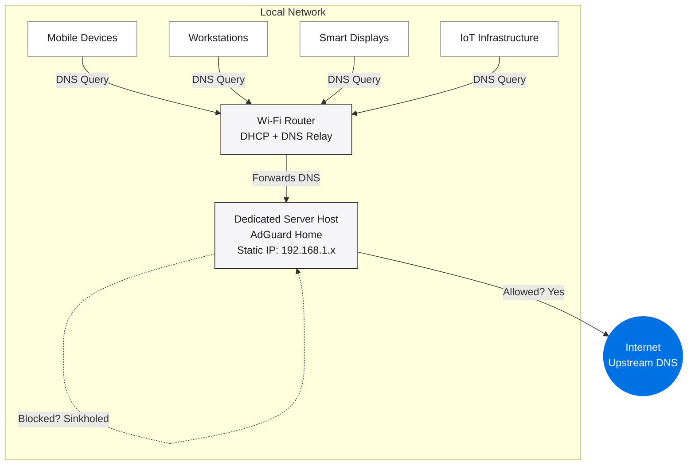
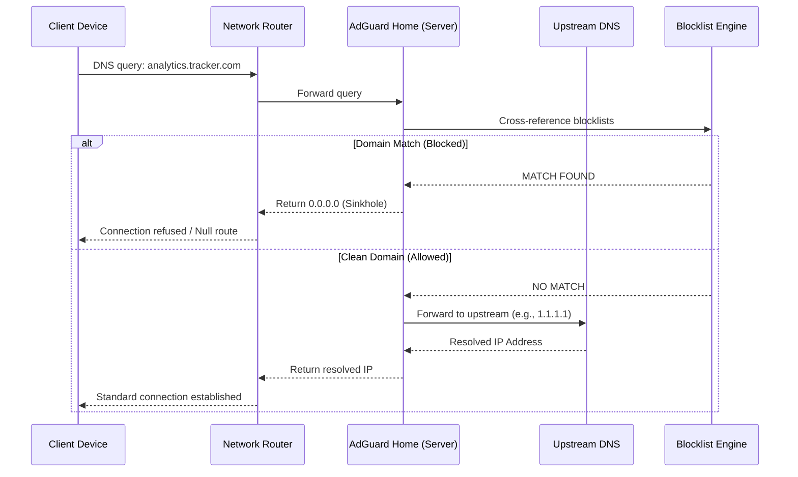
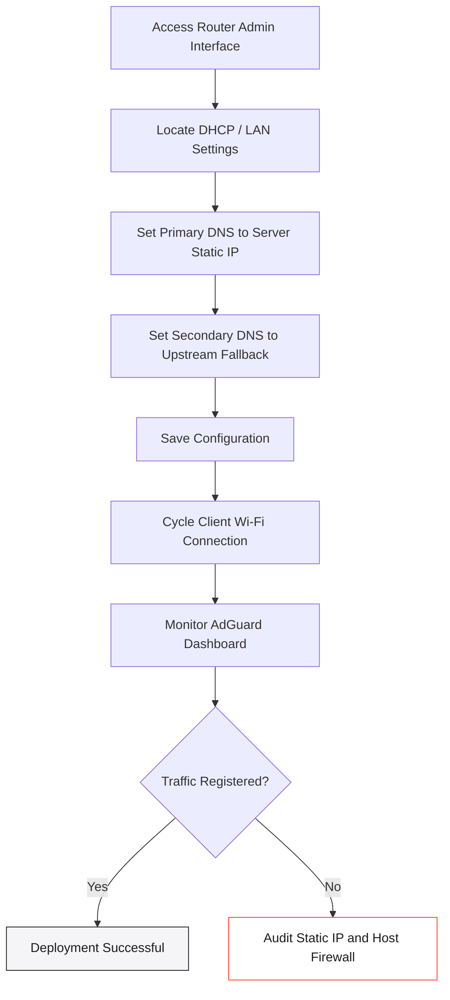
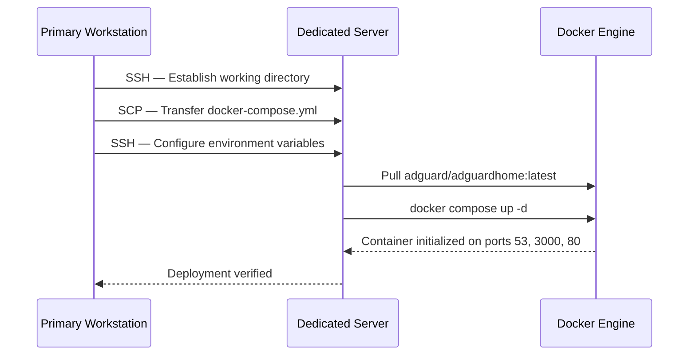

# Home Network DNS Sinkhole

A network-wide ad blocker and DNS filter deployed on a dedicated local server running [AdGuard Home](https://adguard.com/en/adguard-home/overview.html). Every device on the network receives ad-free, tracker-free browsing natively, with no client-side software required.

<p align="center">
  
</p>

---

## Why This Exists

Every device connected to a standard home network transmits hundreds of DNS queries per hour. A significant portion of these requests resolve to ad servers, telemetry endpoints, and tracking domains. Rather than installing individual content blockers on every device, this architecture intercepts DNS at the network infrastructure level. A single server filters all outbound traffic.

By default, an Internet Service Provider (ISP) supplies the DNS resolver, handling all lookups impartially—including malicious or tracking domains. AdGuard Home replaces this default resolver. It processes every network DNS request against strict blocklists, routing identified tracking domains to `0.0.0.0`. Consequently, the ad fails to load, the tracker is neutralized, and no per-device configuration is required.

This implementation leverages the open-source [AdGuard Home](https://github.com/AdguardTeam/AdGuardHome) project.

**Core Objectives:**
*   Eliminate ads and trackers across all network hardware (smartphones, tablets, smart televisions, and IoT devices).
*   Prevent unnecessary telemetry and background data harvesting.
*   Block malicious domain resolution, including phishing and malware command-and-control servers.
*   Achieve zero-touch configuration for client devices.

---

## Project Philosophy

This repository is a deployment workflow and local infrastructure layer built around the official AdGuard Home Docker image.

| | AdGuard Home Repository | This Architecture |
|---|---|---|
| **Primary Function** | Core DNS filtering software | Deployment workflow and infrastructure mapping |
| **Contents** | Source code, user interface, filtering logic | Docker Compose configurations, deployment scripts, documentation |
| **Use Case** | Modifying AdGuard's internal behavior | Deploying AdGuard to dedicated local hardware |

The primary value of this repository is automation and infrastructure management. It provides a repeatable, single-command deployment protocol from a primary workstation to a dedicated local server acting as the network's DNS authority.

---

## System Architecture



### The DNS Sinkhole Mechanism



**The Sinkhole Response:** When a requested domain matches an active blocklist, the server returns an invalid IP address (`0.0.0.0`) instead of the actual destination. The network request terminates immediately at the hardware level. No bandwidth is consumed, and no analytics are transmitted.

### Infrastructure: Before and After

**Standard Configuration (Before):** The local router forwards all internal DNS queries directly to the ISP. The ISP resolves all requests impartially. Advertisements render, tracking scripts execute, and network data is exposed.

**Filtered Configuration (After):** The local router intercepts all DNS queries and routes them strictly to the dedicated local server. Clean traffic resolves normally via encrypted upstream providers. Malicious and tracking domains are sinkholed to `0.0.0.0` and terminate silently. This protection extends automatically to native applications, smart appliances, and operating system telemetry where standard ad-blocking extensions cannot be installed.

---

## Implementation Protocol

### Phase 1: Server Provisioning

The host machine must remain powered on, connected to the local network, and accessible at all times to prevent network-wide DNS failure.

| Step | Action |
|------|--------|
| 1 | **Power Management:** Configure the host operating system to prevent automatic sleep or hibernation. |
| 2 | **Network Identification:** Determine the server's current local IP address (e.g., via `ifconfig`). |
| 3 | **Static Allocation:** Access the local router's administrative panel and bind the server's MAC address to a strict Static IP (DHCP Reservation). |

> **Critical Note:** A static IP is mandatory. If the DHCP server dynamically changes the host machine's IP address, the network will lose all DNS resolution capabilities, effectively severing internet access for all devices.

### Phase 2: Container Deployment

This architecture utilizes Docker Compose to run the service within an isolated container environment. This approach guarantees reproducibility, simplifies updates, and ensures clean environment separation.

**Prerequisites:** The host machine must have Docker Engine and Docker Compose installed and running.

To initialize the environment:

```bash
docker compose up -d
```

This command retrieves the official image and binds the following required network ports:

| Port | Protocol | Purpose |
|------|----------|---------|
| `53` | TCP/UDP | DNS operations — processes all network queries. |
| `3000` | TCP | Initial configuration interface (Setup Wizard). |
| `80` | TCP | Standard web dashboard (Post-setup administration). |

**Data Persistence:**
Volume mapping is utilized to ensure data integrity across container restarts and updates.

| Container Path | Host Path | Storage Purpose |
|----------------|-----------|-----------------|
| `/opt/adguardhome/work` | `./adguardhome/work` | Active runtime data (query logs, statistical analytics). |
| `/opt/adguardhome/conf` | `./adguardhome/conf` | Core configurations (user settings, custom filters). |

### Phase 3: Network Routing Configuration

This final phase integrates the server with the wider network. By modifying the router's core DHCP settings, the entire network is instructed to utilize the newly deployed server as the absolute DNS authority.



**Execution Steps:**

1. Authenticate into the local router's administrative interface (commonly `http://192.168.1.x`).

2. Navigate to the **DHCP**, **LAN Setup**, or **Local Network** configuration menu.

3. Modify the DNS distribution fields:

| Field | Value | Rationale |
|-------|-------|-----------|
| Primary DNS | The server's Static IP (e.g., `192.168.1.x`) | Establishes the host machine as the primary authority. |
| Secondary DNS | `1.1.1.1` (Cloudflare) | Provides a clean fallback to maintain network uptime if the local server requires maintenance. |

4. Save the configuration and allow the router to reboot its DHCP broadcast.

5. Disconnect and reconnect a client device to the network to force a new DHCP lease, then generate web traffic to verify routing.

---

## Verification and Results

Once the router configuration is applied, the network fundamentally changes how it handles data.

Through the deployment script, the Docker container on the host machine successfully binds to port 53. Simultaneously, the home router is instructed to hand out the host's static IP (`192.168.1.x`) to every device that joins the Wi-Fi network.

When a smartphone or workstation connects, it natively asks the host machine for DNS directions. The Docker container intercepts this request, checks the domain against the unified blocklists, and either drops the connection or securely forwards it to the upstream provider.

The resulting analytics, visible on the web dashboard, confirm that local devices are communicating directly with the containerized environment:

<p align="center">

</p>

<p align="center">

</p>

---

## Automated Deployment Script

The included `deploy.sh` script handles the complete remote installation from the primary workstation to the dedicated server via SSH. It automates directory creation, file transfer, and container orchestration.

**Execution Flow:**



**Usage Instructions:**

```bash
# Define remote host credentials in a local environment file
echo "REMOTE_USER=admin" > .env
echo "REMOTE_HOST=192.168.1.x" >> .env

# Execute the deployment protocol
./deploy.sh
```

> **Engineering Note:** Local development environments often utilize system-level credential managers for Docker, which can fail during headless SSH execution. The deployment script programmatically bypasses this by generating an isolated, temporary configuration directory on the remote host, ensuring a seamless container pull and initialization.

---

## Security and Core Configuration

### Encrypted Upstream DNS

To prevent the ISP from monitoring outbound DNS traffic, the server must be configured to utilize encrypted upstream resolvers. DNS-over-TLS (DoT) is highly recommended.

Navigate to **Settings > DNS Settings** and input the following:

```
tls://1.1.1.1       # Cloudflare Primary (DoT)
tls://1.0.0.1       # Cloudflare Secondary (DoT)
tls://8.8.8.8       # Google Primary (DoT)
```

### Curated Blocklists

While the default filtering lists are highly capable, adding curated, community-driven blocklists significantly enhances the sinkhole's effectiveness against smart television telemetry and embedded application trackers.

Recommended additions via **Filters > DNS Blocklists**:

| Target List | Primary Focus |
|-------------|---------------|
| AdGuard DNS Filter | Broad-spectrum advertising and trackers. |
| Steven Black's Hosts | Unified repository for adware and malware endpoints. |
| OISD Full | Aggressive, low-false-positive telemetry blocking. |

---

## Project Structure

```
DNS-deployment/
├── README.md                  # System documentation
├── .env                       # Environment parameters (Excluded from version control)
├── .gitignore                 # Repository exclusion rules
├── docker-compose.yml         # Container architecture definition
├── deploy.sh                  # Remote SSH automation script
└── images/                    # Documentation assets
    ├── adguard-dashboard.png
    └── adguard-stats.png
```

---

## System Maintenance

The `restart: unless-stopped` directive within the Docker Compose file ensures high availability. If the host machine reboots or the container faults, Docker will automatically attempt a restart.

Standard operational commands (run via SSH on the host machine):

```bash
# Verify active container status
docker compose ps

# Monitor real-time DNS processing logs
docker compose logs -f adguardhome

# Execute a manual system restart
docker compose restart

# Update the architecture to the latest stable release
docker compose pull && docker compose up -d
```

---

## Diagnostic Checks

To definitively verify that the infrastructure is actively routing and filtering data:

| Objective | Verification Method |
|-----------|---------------------|
| Verify Server Reachability | Execute `nslookup google.com 192.168.1.x` from a client workstation. |
| Confirm Active Sinkholing | Execute `nslookup doubleclick.net 192.168.1.x`. A successful block returns `0.0.0.0`. |
| Audit Traffic Logs | Access the server dashboard via browser (`http://192.168.1.x`) and monitor the Query Log. |

---

## Technology Stack

| Component | Function |
|-----------|----------|
| Dedicated Server Host | Always-on hardware executing the DNS resolver. |
| Primary Workstation | Administrative terminal for orchestration and deployment. |
| Docker & Compose | Container runtime engine and declarative environment orchestration. |
| AdGuard Home | Core DNS sinkhole and filtering logic. |
| Local Router | Network DHCP authority and primary gateway. |
| DNS-over-TLS | Cryptographic protocol for securing upstream queries. |
| SSH / SCP | Secure transport layer for remote system management. |

---

## License

This infrastructure utilizes [AdGuard Home](https://github.com/AdguardTeam/AdGuardHome), governed under the [GNU General Public License v3.0 (GPL-3.0)](https://github.com/AdguardTeam/AdGuardHome/blob/master/LICENSE.txt).
