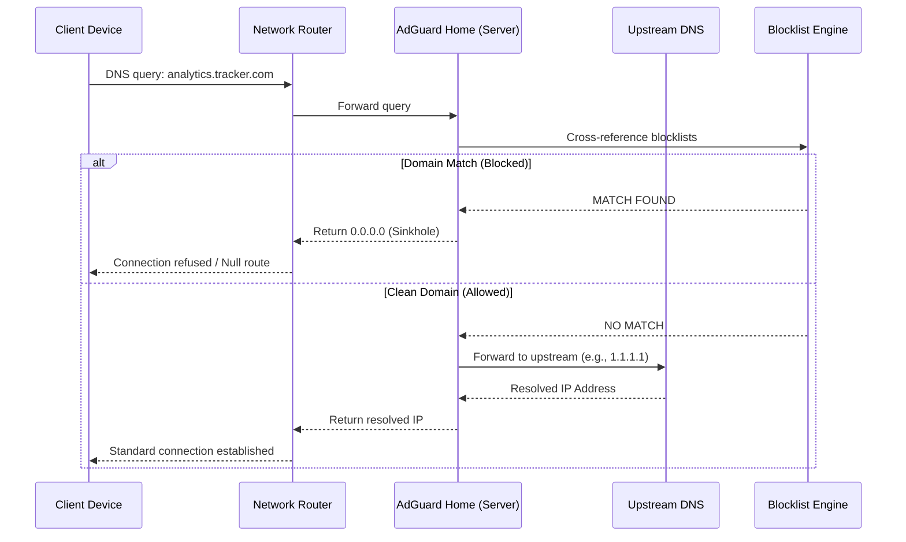
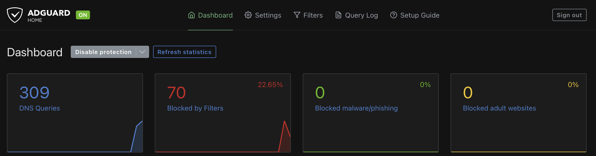

# Home Network DNS Sinkhole: Implementation Report

This repository documents the deployment of a network-wide DNS sinkhole on a local home network. The objective of this project was to intercept and filter all local DNS traffic through a dedicated server running AdGuard Home. This infrastructure neutralizes tracking telemetry and advertisements at the router level, providing network-wide protection without requiring per-device configuration.

  

---

## 1. System Architecture

The infrastructure relies on a dedicated local host running a Dockerized instance of AdGuard Home, seamlessly integrated with the existing ISP gateway.

## 2. Implementation Methodology

The deployment was executed in three distinct phases: server provisioning, container orchestration, and network routing configuration.

### 2.1 Server Provisioning & Containerization

A dedicated local machine was assigned a strict static IP (`192.168.1.x`) via the router's DHCP reservation settings to ensure high availability. The filtering engine, AdGuard Home, was deployed via Docker Compose to maintain a reproducible and isolated environment.

A custom bash script (`deploy.sh`) was engineered to automate the remote deployment via SSH, securely transferring the configuration files and initializing the container on port 53.

### 2.2 ISP Router Configuration (Fastweb Integration)

The primary technical challenge involved reconfiguring the ISP-provided gateway (a Fastweb router) to distribute the new DNS configuration natively. ISPs often lock down consumer hardware to force traffic through their own resolvers.

**Bypassing ISP Hijacking:** The router's default "DNS Protetto" (Protected DNS) feature was disabled. Left active, this mechanism forces all local DNS traffic through an encrypted tunnel directly to Fastweb's servers, completely bypassing any local DNS configurations and pushing unwanted IPv6 addresses to client devices.

**DHCP Modification:** With the ISP override disabled, the router's core LAN DHCP settings were unlocked. The Primary DNS field was updated to broadcast the dedicated server's static IP (`192.168.1.x`).

Consequently, any device joining the Wi-Fi network automatically receives the local server as its absolute DNS authority.

## 3. The DNS Sinkhole Mechanism

With the routing established, the system processes traffic according to the following logic:

When a requested domain matches a curated blocklist, the server returns a null route (`0.0.0.0`). The network request terminates immediately at the hardware level, preventing tracking scripts from executing and conserving bandwidth.

## 4. Verification and Results

Post-deployment testing confirmed that the network fundamentally altered its data handling. The infrastructure was verified using command-line DNS lookup tools to ensure traffic was successfully routing to the local server rather than the ISP.

Executing `nslookup doubleclick.net 192.168.1.x` successfully returned `0.0.0.0`, confirming the sinkhole was active and rejecting tracking domains.

The resulting analytics, visible on the container's web dashboard, confirmed that all local hardware was communicating directly with the new environment:

  

  

## 5. Security and Maintenance

**Encrypted Upstream DNS:** To prevent ISP surveillance on outbound traffic, the server is configured to utilize DNS-over-TLS (DoT) via providers like Cloudflare (`tls://1.1.1.1`).

**High Availability:** The Docker container utilizes a `restart: unless-stopped` policy, ensuring the DNS service automatically recovers following host system reboots.

**Zero-Touch Client Roaming:** Because the configuration is handled entirely by the home router's DHCP, portable workstations seamlessly revert to standard, unblocked DNS resolution when connecting to external public networks (e.g., university or cafe Wi-Fi), requiring no manual profile switching by the user.

## License

This infrastructure utilizes [AdGuard Home](https://github.com/AdguardTeam/AdGuardHome), governed under the [GNU General Public License v3.0 (GPL-3.0)](https://www.gnu.org/licenses/gpl-3.0.en.html).
