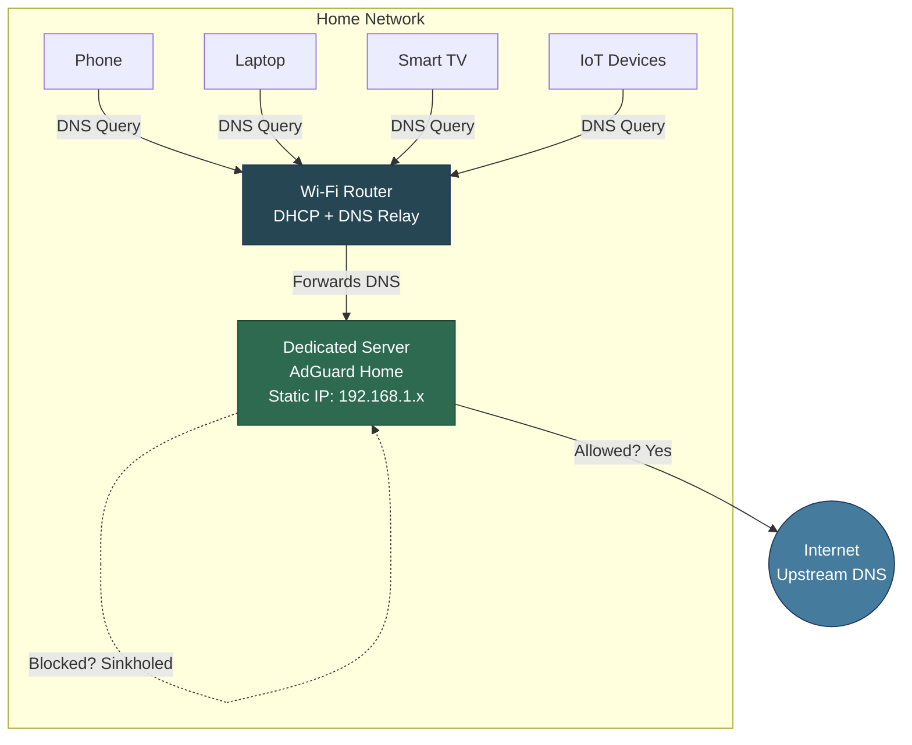
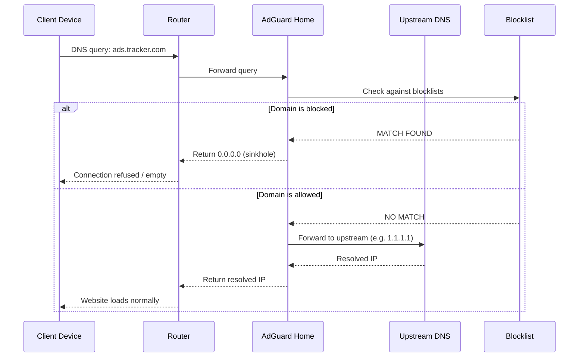
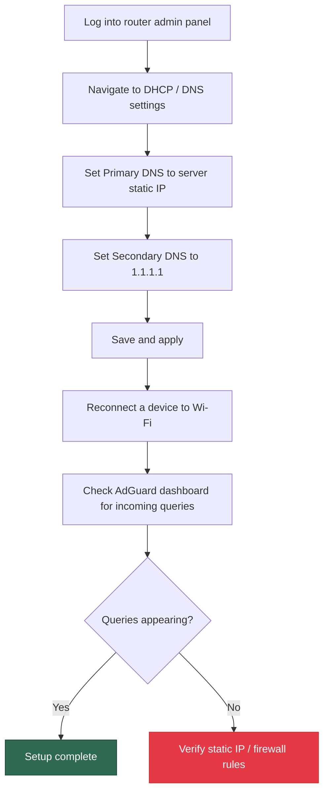
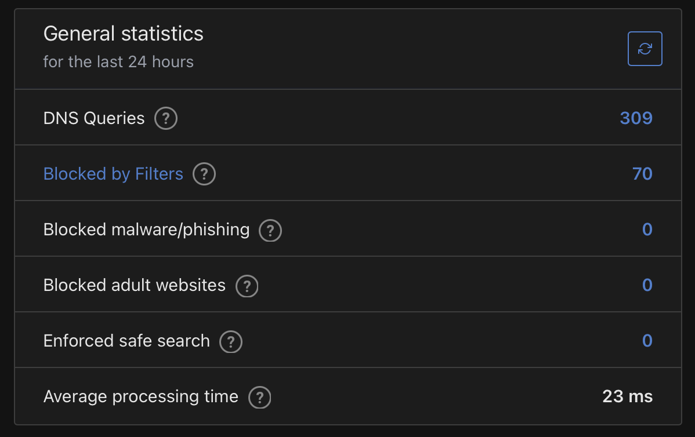
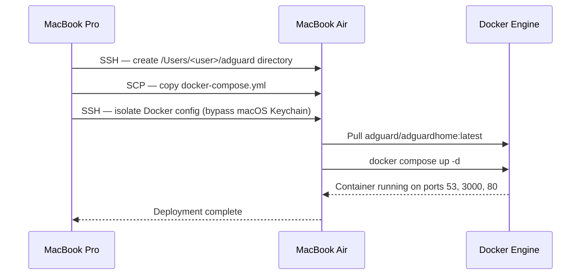

# Home Network DNS Sinkhole

A network-wide ad blocker and DNS filter deployed on a dedicated local server running [AdGuard Home](https://adguard.com/en/adguard-home/overview.html). Every device on the network gets ad-free, tracker-free browsing — no client-side software required.

<p align="center">
  
</p>

---

## Why This Exists

Every device on a home network sends hundreds of DNS queries per hour. Many resolve to ad servers, telemetry endpoints, and tracking domains. Instead of installing an ad blocker on every device, this project intercepts DNS at the network level — one server filters everything.

Normally, your ISP's DNS resolver handles all lookups, including ads and trackers. AdGuard Home replaces that middleman. It checks every DNS request against a blocklist and routes known bad domains to `0.0.0.0` — the ad never loads, the tracker never fires, and no per-device setup is required.

This project was inspired by the [AdGuard Home](https://github.com/AdguardTeam/AdGuardHome) open-source project.

**What it solves:**
- Ads and trackers across all devices (phones, tablets, smart TVs, IoT)
- Unnecessary telemetry and data collection
- Malicious domain resolution (phishing, malware C2 servers)
- No per-device configuration needed

---

## Project Philosophy

This repo is **not** a fork of AdGuard Home. It is a **deployment workflow and local infrastructure layer** built on top of the official AdGuard Home Docker image.

| | AdGuard Home Repo | This Project |
|---|---|---|
| **Purpose** | DNS filtering product | Deployment workflow + local infrastructure |
| **Contains** | Source code, UI, filtering logic | Docker Compose, deploy script, documentation |
| **You'd use it to** | Modify AdGuard's behavior | Deploy AdGuard to your own hardware |

The value here is **automation + infrastructure**: a repeatable, one-command deployment from a MacBook Pro to a dedicated MacBook Air acting as the DNS server. No changes to AdGuard's code are needed or made.

---

## System Architecture



---

## How DNS Sinkholing Works



**Sinkhole response:** When a domain is on a blocklist, AdGuard returns `0.0.0.0` instead of the real IP. The request dies silently — no ad loads, no tracker fires, no data leaves the network.

---

## Before and After

**Before:** Your router forwards every DNS query to your ISP, which resolves everything — including ad servers, trackers, and telemetry endpoints. Ads load, trackers fire, data leaves your network.

**After:** Your router forwards DNS to AdGuard Home on your MacBook Air instead. Legitimate domains resolve normally. Ad and tracking domains get sinkholed to `0.0.0.0` — the request dies silently. This works on every device on the network, including smart TVs, IoT gadgets, and mobile apps where you cannot install a browser extension.

---

## Implementation

### Phase 1 — Server Setup

The dedicated server (MacBook Air) must stay online and reachable at all times. It acts as the DNS resolver for the entire network.

| Step | Action |
|------|--------|
| 1 | Disable automatic sleep: **System Settings > Displays > Advanced > Prevent automatic sleeping when display is off** |
| 2 | Identify the server's local IP address (`ifconfig | grep inet`) |
| 3 | Assign a **static IP** to the server via your router's admin panel (DHCP reservation) |

> A static IP is critical. If the server's IP changes, every device on the network loses DNS resolution.

### Phase 2 — AdGuard Home Installation (Docker)

This project uses Docker Compose to run AdGuard Home in a container. This keeps the installation isolated, reproducible, and easy to back up or migrate.

**Prerequisites:** Docker and Docker Compose must be installed on the server.

Start the container:

```bash
docker compose up -d
```

This pulls the official `adguard/adguardhome` image and starts it with:

| Port | Protocol | Purpose |
|------|----------|---------|
| `53` | TCP/UDP | DNS — all network DNS queries hit this port |
| `3000` | TCP | Setup wizard (first-time configuration only) |
| `80` | TCP | Web UI dashboard (after setup is complete) |

**Persistent volumes** are mapped to `./adguardhome/` on the host:

| Container Path | Host Path | Stores |
|----------------|-----------|--------|
| `/opt/adguardhome/work` | `./adguardhome/work` | Runtime data (query logs, stats) |
| `/opt/adguardhome/conf` | `./adguardhome/conf` | Configuration (settings, blocklists, filters) |

These volumes survive container restarts, rebuilds, and image updates — settings are never lost.

After starting, open the setup wizard from any device on the network:

```
http://<SERVER_IP>:3000
```

Complete the wizard — set admin credentials and configure the listening interface.

**Post-setup dashboard access:**

```
http://<SERVER_IP>:80
```

### Phase 3 — Router Configuration

This is where the magic happens. You are telling your router to stop asking your ISP for DNS answers and start asking your MacBook Air instead.



#### Step-by-Step

1. Log into your router's admin panel (usually `http://192.168.1.1`)
2. Navigate to **DHCP**, **LAN Setup**, or **DNS Settings**
3. Set the DNS fields:

| Field | Value | Why |
|-------|-------|-----|
| Primary DNS | MacBook Air's static IP (e.g. `192.168.1.51`) | Makes the Air the DNS authority for all devices |
| Secondary DNS | `1.1.1.1` (Cloudflare) | Fallback — keeps Wi-Fi alive if the Air goes down |

4. Save and apply. The router may take 30-60 seconds to restart its broadcast.
5. Reconnect a device to Wi-Fi, generate some traffic, and check the AdGuard dashboard for incoming queries.

#### Finding Your Router's IP on macOS

**System Settings > Wi-Fi > Details** (next to your connected network) — scroll to the **Router** field.

<p align="center">
  
</p>

---

## Results

After completing the setup, the AdGuard Home dashboard shows real-time filtering statistics across all network devices:

<p align="center">
  
</p>

<p align="center">
  
</p>

---

## Deployment Script

The `deploy.sh` script automates the entire deployment from the MacBook Pro to the MacBook Air over SSH. It eliminates manual steps and handles the macOS-specific Docker Keychain issue.

**What it does:**



**Usage:**

```bash
# Create .env with your Air's credentials
echo "REMOTE_USER=yourusername" > .env
echo "REMOTE_HOST=192.168.1.51" >> .env

# Run the deployment
./deploy.sh
```

**Key implementation detail:** macOS Docker Desktop uses the system Keychain for credential storage, which fails over SSH. The deploy script works around this by creating an isolated `DOCKER_CONFIG` directory with an empty `config.json`, bypassing the Keychain helper entirely.

---

## AdGuard Home — Key Configuration

### Upstream DNS Servers

AdGuard forwards allowed queries to upstream resolvers. Recommended configuration:

```
tls://1.1.1.1       # Cloudflare (DNS-over-TLS)
tls://1.0.0.1       # Cloudflare secondary
tls://8.8.8.8       # Google
```

Using DNS-over-TLS (`tls://`) encrypts DNS queries between AdGuard and the upstream resolver, preventing ISP snooping.

### Blocklists

AdGuard ships with a default blocklist. Recommended additions:

| Blocklist | Purpose |
|-----------|---------|
| AdGuard DNS Filter | General ads and trackers |
| Steven Black's Hosts | Unified hosts file (ads + malware) |
| OISD Full | One of the largest curated blocklists |
| Dan Pollock's hosts | Lightweight, well-maintained |

Add blocklists in: **Filters > DNS Blocklists > Add blocklist**

---

## Project Structure

```
DNS-deployment/
├── README.md                  # This document
├── .env                       # Remote host/user config (not committed)
├── .gitignore                 # Ignores .env and runtime data
├── docker-compose.yml         # AdGuard Home container definition
├── deploy.sh                  # SSH deployment script (Pro → Air)
└── images/                    # Screenshots and diagrams
    ├── adguard-dashboard.png  # AdGuard Home dashboard
    ├── adguard-stats.png      # AdGuard Home filtering statistics
    └── router-ip-macos.png    # macOS Wi-Fi settings showing router IP
```

---

## Keeping the Server Running

The `restart: unless-stopped` policy in `docker-compose.yml` ensures AdGuard Home automatically restarts after crashes or system reboots (as long as Docker itself starts on boot).

```bash
# Check container status
docker compose ps

# View live logs
docker compose logs -f adguardhome

# Restart the container
docker compose restart

# Pull latest image and recreate
docker compose pull && docker compose up -d
```

---

## Verification

After setup, confirm everything works:

| Check | Command / Method |
|-------|-----------------|
| Server DNS is reachable | `nslookup google.com <SERVER_IP>` |
| Ads are being blocked | `nslookup ads.google.com <SERVER_IP>` should return `0.0.0.0` |
| Dashboard shows queries | Visit `http://<SERVER_IP>` and check the query log |
| Upstream DNS is encrypted | AdGuard dashboard > Settings > DNS shows `tls://` upstreams |

---

## Tech Stack

| Component | Role |
|-----------|------|
| MacBook Air | Always-on DNS resolver host |
| MacBook Pro | Deployment controller (runs `deploy.sh`) |
| Docker + Docker Compose | Container runtime and orchestration |
| AdGuard Home | DNS sinkhole + filtering engine |
| Wi-Fi Router | DHCP server, forwards DNS to AdGuard |
| DNS-over-TLS | Encrypted upstream DNS resolution |
| SSH + SCP | Remote deployment transport |

---

## License

This project uses [AdGuard Home](https://github.com/AdguardTeam/AdGuardHome), which is licensed under the [GNU General Public License v3.0 (GPL-3.0)](https://github.com/AdguardTeam/AdGuardHome/blob/master/LICENSE.txt).
