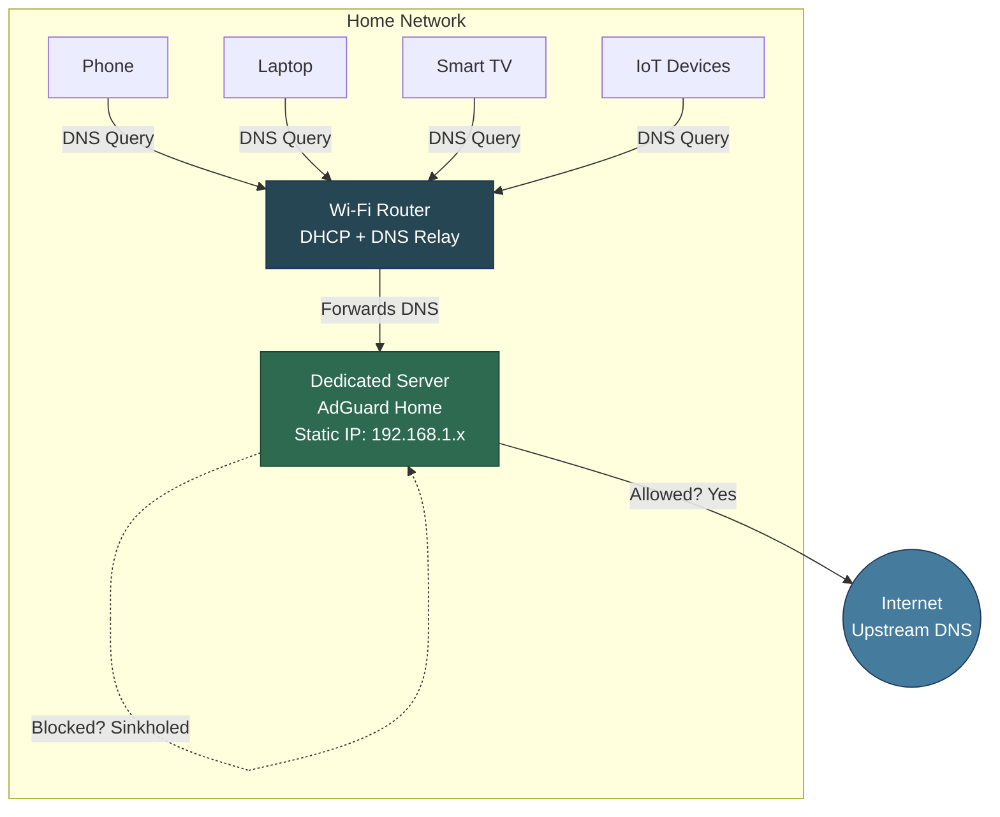
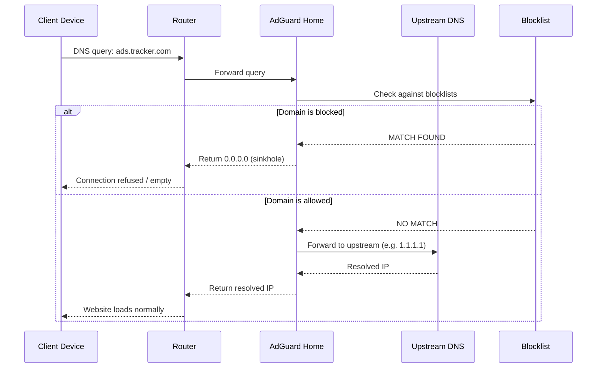
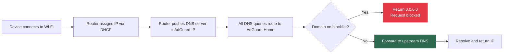
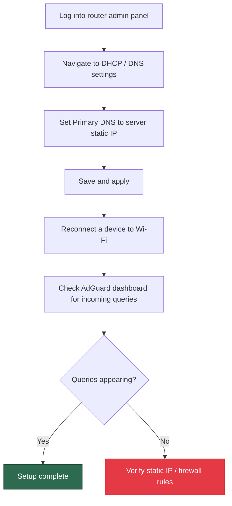
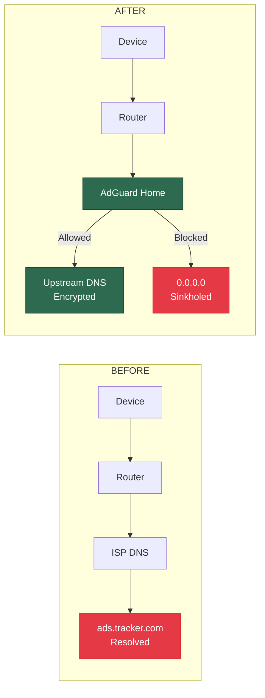

# Home Network DNS Sinkhole

A network-wide ad blocker and DNS filter deployed on a dedicated local server running [AdGuard Home](https://adguard.com/en/adguard-home/overview.html). Every device on the network gets ad-free, tracker-free browsing — no client-side software required.

---

## Inspiration

This project was inspired by the [AdGuard Home](https://github.com/AdguardTeam/AdGuardHome) open-source project. Reading through their repository and documentation made the concept click: you can run your own private DNS server that silently kills ads and trackers before they ever reach your devices.

Normally, when you type a website into your browser, your device asks a DNS server to translate that domain name into an IP address. That DNS server is usually provided by your ISP — and it resolves everything, including ad servers, tracking pixels, and telemetry endpoints. AdGuard Home replaces that middleman. It sits between your devices and the internet, checks every DNS request against a blocklist, and routes known bad domains into a black hole (an invalid address like `0.0.0.0`). The ad never loads, the tracker never fires, and your bandwidth is saved — all without installing anything on individual devices.

That idea — one server protecting an entire network — is what this project implements from scratch on a home network.

---

## Why This Exists

Every device on a typical home network sends hundreds of DNS queries per hour. Many of those queries resolve to ad servers, telemetry endpoints, and tracking domains. Instead of installing an ad blocker on every device individually, this project intercepts DNS at the network level — one server filters everything.

**What it solves:**
- Ads and trackers across all devices (phones, tablets, smart TVs, IoT)
- Unnecessary telemetry and data collection
- Malicious domain resolution (phishing, malware C2 servers)
- No per-device configuration needed

---

## System Architecture



---

## How DNS Sinkholing Works



**Sinkhole response:** When a domain is on a blocklist, AdGuard returns `0.0.0.0` instead of the real IP. The request dies silently — no ad loads, no tracker fires, no data leaves the network.

---

## Network Flow Overview



---

## Implementation

### Phase 1 — Server Setup

The dedicated server must stay online and reachable at all times. It acts as the DNS resolver for the entire network.

| Step | Action |
|------|--------|
| 1 | Disable automatic sleep: **System Settings > Displays > Advanced > Prevent automatic sleeping when display is off** |
| 2 | Identify the server's local IP address (`ifconfig \| grep inet`) |
| 3 | Assign a **static IP** to the server via your router's admin panel (DHCP reservation) |

> A static IP is critical. If the server's IP changes, every device on the network loses DNS resolution.

### Phase 2 — AdGuard Home Installation

Install AdGuard Home on the server:

```bash
curl -s -S -L https://raw.githubusercontent.com/AdguardTeam/AdGuardHome/master/scripts/install.sh | sh -s -- -v
```

After installation, open the setup wizard from any device on the network:

```
http://<SERVER_IP>:3000
```

Complete the wizard — set admin credentials and configure the listening interface.

**Post-setup dashboard access:**

```
http://<SERVER_IP>:80
```

### Phase 3 — Router Configuration



**Router DNS Settings:**

| Field | Value |
|-------|-------|
| Primary DNS | `<SERVER_STATIC_IP>` |
| Secondary DNS | `1.1.1.1` (fallback if server is offline) |

> Setting a secondary DNS (like Cloudflare `1.1.1.1` or Google `8.8.8.8`) ensures the network doesn't go dark if the server reboots.

---

## AdGuard Home — Key Configuration

### Upstream DNS Servers

AdGuard forwards allowed queries to upstream resolvers. Recommended configuration:

```
tls://1.1.1.1       # Cloudflare (DNS-over-TLS)
tls://1.0.0.1       # Cloudflare secondary
tls://8.8.8.8       # Google
```

Using DNS-over-TLS (`tls://`) encrypts DNS queries between AdGuard and the upstream resolver, preventing ISP snooping.

### Blocklists

AdGuard ships with a default blocklist. Recommended additions:

| Blocklist | Purpose |
|-----------|---------|
| AdGuard DNS Filter | General ads and trackers |
| Steven Black's Hosts | Unified hosts file (ads + malware) |
| OISD Full | One of the largest curated blocklists |
| Dan Pollock's hosts | Lightweight, well-maintained |

Add blocklists in: **Filters > DNS Blocklists > Add blocklist**

---

## Project Structure

```
home-network-dns-sinkhole/
├── README.md                  # This document
├── screenshots/               # AdGuard dashboard screenshots
│   ├── dashboard-overview.png
│   ├── query-log.png
│   └── blocked-domains.png
└── scripts/
    └── healthcheck.sh         # Optional: server uptime monitor
```

---

## DNS Resolution Path — Before vs. After



---

## Keeping the Server Running

To ensure AdGuard Home stays up and restarts after a reboot:

```bash
# Check service status
sudo launchctl list | grep AdGuardHome

# If AdGuard was installed via the script, it registers as a launch daemon automatically.
# Verify with:
sudo launchctl print system/com.adguardhome.AdGuardHome
```

Optional healthcheck script (`scripts/healthcheck.sh`):

```bash
#!/bin/bash
# Ping AdGuard Home API to verify it's responding
RESPONSE=$(curl -s -o /dev/null -w "%{http_code}" http://localhost:80/control/status)

if [ "$RESPONSE" -ne 200 ]; then
    echo "[$(date)] AdGuard Home is DOWN. Restarting..." >> /var/log/adguard-healthcheck.log
    sudo /Applications/AdGuardHome/AdGuardHome -s restart
else
    echo "[$(date)] AdGuard Home is UP." >> /var/log/adguard-healthcheck.log
fi
```

Schedule it with cron:

```bash
# Run every 5 minutes
*/5 * * * * /path/to/scripts/healthcheck.sh
```

---

## Verification

After setup, confirm everything works:

| Check | Command / Method |
|-------|-----------------|
| Server DNS is reachable | `nslookup google.com <SERVER_IP>` |
| Ads are being blocked | `nslookup ads.google.com <SERVER_IP>` should return `0.0.0.0` |
| Dashboard shows queries | Visit `http://<SERVER_IP>` and check the query log |
| Upstream DNS is encrypted | AdGuard dashboard > Settings > DNS shows `tls://` upstreams |

---

## Tech Stack

| Component | Role |
|-----------|------|
| Dedicated local server | Always-on DNS resolver host |
| AdGuard Home | DNS sinkhole + filtering engine |
| Wi-Fi Router | DHCP server, forwards DNS to AdGuard |
| DNS-over-TLS | Encrypted upstream DNS resolution |

---

## License

This project uses [AdGuard Home](https://github.com/AdguardTeam/AdGuardHome), which is licensed under the [GNU General Public License v3.0 (GPL-3.0)](https://github.com/AdguardTeam/AdGuardHome/blob/master/LICENSE.txt).
